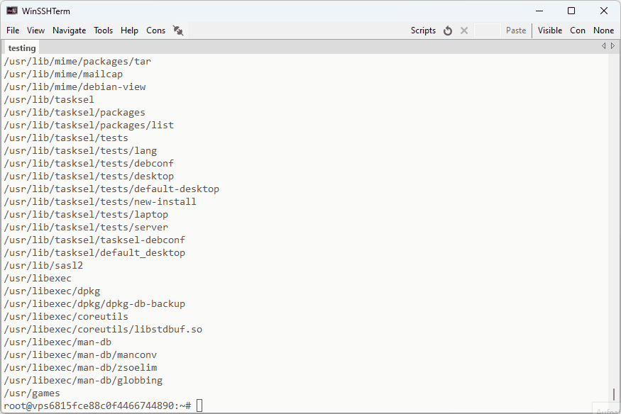

# PuTTY-WST
A fork of Simon Tatham's SSH client "PuTTY" for use with WinSSHTerm 2.41.0 or higher.

## Changes
* Scroll behaviour similar to Windows Terminal (mouse wheel and trackpad)
* Change font size with CTRL+MOUSEWHEEL

